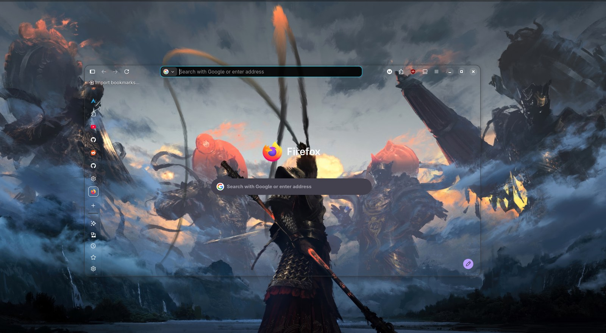
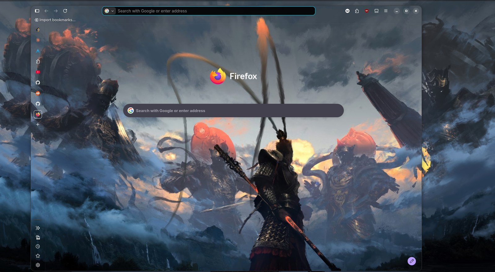

# firefox-transparent-toolbar

A `userChrome.css` that makes the Firefox toolbar band — tab strip, address bar and
bookmarks bar — genuinely see-through to your desktop, not merely dark.

Written and tested against **Firefox 155 on Linux** (GNOME / Wayland).



The window's chrome dissolves into whatever is behind it. Above, an unmaximized window —
the wallpaper runs straight through the toolbar and the page with no seam.



Both shots are see-through mode over a bare desktop; wallpaper mode looks the same here
and only differs when another window sits behind Firefox. The vertical tab strip is a
Firefox setting, not part of this theme — it inherits the transparency like any other
toolbar.

## Why this isn't a theme

Themes can't do it. Firefox paints the window background from your theme's `frame`
colour, and treats that colour as opaque by definition — the comment is right there in
`browser-shared.css`:

```css
:root[lwtheme] & {
  background-color: var(--lwt-accent-color); /* Known opaque */
```

So a theme can set colours *within* an opaque window, but it can't remove the window's
backing. Themes that advertise transparency render as solid black for this reason. Only
a user stylesheet can clear `--lwt-accent-color`, which is what this file does.

## Install

1. **Find your profile folder.** Open `about:profiles` and copy the **Root Directory**
   of the profile marked *This is the profile in use*.

   Firefox 155 on Linux stores profiles under `~/.config/mozilla/firefox/<id>`.
   Older builds use `~/.mozilla/firefox/<id>`. Don't guess — check `about:profiles`,
   because writing to the wrong one looks exactly like the CSS silently not working.

2. **Drop the file in.**

   ```sh
   cd /path/to/your/profile
   mkdir -p chrome
   cp /path/to/userChrome.css chrome/
   ```

3. **Enable user stylesheets.** They've been off by default since Firefox 69. Either set
   `toolkit.legacyUserProfileCustomizations.stylesheets` to `true` in `about:config`, or
   put it in a `user.js` in the profile root so it survives a `prefs.js` rewrite:

   ```js
   user_pref("toolkit.legacyUserProfileCustomizations.stylesheets", true);
   ```

4. **Fully quit Firefox and start it again.** Not just closing the window — the process
   has to exit. Chrome CSS is read once, at startup.

## Tuning

Everything is driven by three variables at the top of the file:

| Variable | Default | What it does |
|---|---|---|
| `--bar-alpha` | `0.15` | Tint strength. `0` is fully see-through; raise it if text is hard to read over a busy wallpaper. |
| `--bar-tint` | `20 20 26` | The tint colour, as an `R G B` triplet. |
| `--content-backstop` | `#1b1b1f` | Painted behind pages that declare no background of their own, so they don't go see-through too. |

Restart after editing.


## Optional: a see-through page area too

By default the page area stays opaque, so the wallpaper stops at the bottom of the
bookmarks bar and the window looks half-finished. `userContent.css` carries it down the
rest of the window.

```sh
cp userContent.css /path/to/your/profile/chrome/
```

`embed-wallpaper.py` writes that file at the same time as `userChrome.css` — same image,
same screen size — so re-copy both after every run. Restart Firefox and the New Tab page
picks up exactly where the toolbar left off.

**It is a copy, not a hole.** The page area can't be made genuinely see-through on
Firefox 155. `about:newtab` renders in the privileged about content process and its
canvas is painted before any page style applies: clearing the background on `:root`,
`body`, `#root`, `.outer-wrapper` and `main`, with and without
`browser.tabs.allow_transparent_browser`, leaves the same opaque slab. A *red* background
set from the same file shows up fine, so the sheet is applying — the paint just isn't the
document's to remove.

So the page paints its own copy, anchored with `background-position: left bottom`. The
content viewport's bottom edge is the window's bottom edge, so on a maximized window that
lines the copy up with the real desktop exactly, with no offset to calibrate — verified
pixel-for-pixel against the source image. Same trade as wallpaper mode: correct while
maximized.

Pair it with wallpaper mode. In see-through mode the toolbar shows whatever is actually
behind the window while the page shows the copy, so the two only agree over a bare
desktop.

## Optional: wallpaper mode

True transparency is transparent to whatever is actually behind the window — which is
usually another window, not your desktop. If you want the wallpaper to show *regardless*
of what's behind Firefox, this mode paints your wallpaper as the window's own
background, positioned to line up with where the window sits on screen. Terminal
emulators call this pseudo-transparency.

Needs [Pillow](https://pypi.org/project/pillow/) (`pip install pillow`).

```sh
python3 embed-wallpaper.py                 # reads your current GNOME wallpaper
python3 embed-wallpaper.py ~/pic.jpg       # or point it at any image
```

Then set `userchrome.wallpaper.on` to `true` in `about:config` and restart Firefox. The
pref toggles live afterwards — `true` for the wallpaper, `false` for genuine
see-through.

The script scales and centre-crops the image to your screen the way GNOME's `zoom`
option does, so the copy matches the real desktop, then embeds it in the stylesheet as a
`data:` URI.

The size it targets is your screen in **logical** pixels, which is what chrome CSS is
laid out in — not the panel's physical mode. Those agree only at 100% scaling: a
2560x1600 panel at 133% is 1920x1200 to the stylesheet, and embedding 2560x1600 there
paints the wallpaper a third too large. The scale comes from `~/.config/monitors.xml`
and is divided out automatically; `--scale=1.3333` overrides the detected factor and
`--screen=1920x1200` overrides the result outright.

**Calibrate the offset once.** `--wallpaper-offset-y` (default `32px`) is the height of
your desktop panel — how far down the screen the window's top edge sits when maximized.
If the image inside the window sits lower than the real wallpaper, raise it; if higher,
lower it. A pixel or two at a time.

**What you're trading.** It's a picture, not a window into the desktop, so it's only
aligned while Firefox is **maximized** — move or unmaximize it and the image stays put
while the window doesn't. It won't follow a wallpaper change either; re-run the script.
You can have "always shows the wallpaper" or "always correct as the window moves", not
both.

## Optional: the GNOME extension instead

Wallpaper mode trades alignment for always showing the wallpaper. `gnome-extension/`
removes the trade: it inserts the wallpaper into the compositor directly beneath the
Firefox window, clipped to the window, so the toolbar stays genuinely see-through,
ignores the windows in between, *and* stays aligned as the window moves. It needs a
logout to install. See [gnome-extension/README.md](gnome-extension/README.md).

Use one or the other — with the extension running, set `userchrome.wallpaper.on` back
to `false`.

## Troubleshooting

**Nothing changed at all.** Confirm the pref is actually set and that you edited the
profile `about:profiles` says is in use. To prove the sheet is being loaded, add
`#nav-bar { background-color: #ff00ff !important; }` at the end and restart — a magenta
address bar row means the file is live and the problem is elsewhere.

**The bar is still a solid block, and the sheet *is* loading.** Your theme is probably
painting a `theme_frame` image. Firefox draws it on `<body>` whenever the image isn't in
the toolbox:

```css
:root:not([theme-image-in-toolbox]) body { background-image: var(--toolbox-background-image); }
```

Plenty of themes ship a flat single-colour band as that image, which covers the whole
toolbar and looks identical to an opaque background. This file already clears it. Note
the rule needs an `html|` prefix — a user stylesheet declares XUL as its default
namespace, so a bare `body` selector matches a XUL element and silently never applies.

**The bar goes dark instead of showing the desktop.** Your compositor isn't giving the
window an alpha channel. Nothing in CSS fixes that; raise `--bar-alpha` and treat it as
a tint instead.

**One toolbar row stays opaque grey.** On Linux, toolkit's `toolbar.css` paints every
`<toolbar>` with the GTK `-moz-headerbar` colour. Clearing `background` isn't enough
while the widget is still natively themed — it needs `appearance: none` too.

## A note on selector names

Firefox 155 renamed several theme variables. Older guides still reference
`--toolbar-bgcolor` and `--tab-selected-bgcolor`; the current names are
`--toolbar-background-color` and `--tab-background-color-selected`. If you're adapting an
older snippet and half of it seems to do nothing, that's usually why.

**The wallpaper doesn't paint, but the rest works.** The `data:` URL has to sit
literally in `background-image`. Routed through a custom property — `--wallpaper: url(...)`
then `background-image: var(--wallpaper)` — it parses without error and silently never
paints. Referencing the image by path doesn't work either: a chrome document won't load
a `file://` image, and a relative `url()` inside a custom property resolves against the
document's `chrome://` base URI rather than the stylesheet. Hence embedding.
